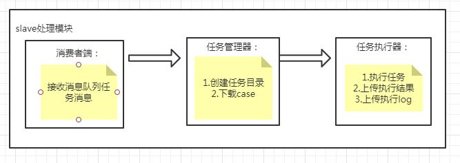

# slave
## slave模块介绍

执行：  
开启redis服务  
slave_run.py文件：web接口,提供对slave的其他操作  
slave_task_consumer.py文件：任务监听处理入口+心跳  

功能描述：    
1.ui,api自动化任务执行器    
2.任务执行完日志收集及上传    
3.提供slave机器系统参数上报接口   
4.从ftpserver下载ui用例

实现介绍：   
1.ui自动化：yml存放页面元素定位信息，unittest组织用例结构，selenium驱动浏览器    
2.api自动化：根据任务传输的api case信息通过封装好的方法带入case信息而执行case    
3.redis实现任务的收发（redis简单无需安装，适合放在git上）   
4.执行流程： 任务接收分配器 -- 任务管理器 -- 任务执行器    

详情：    
1.任务格式：    
'''python
    task = {"id": 5662356461,
            "type": "api",
            "slave": "1.1.1.1",
            "version": "0.0.1",
             "cases": [
                     {"caseid": "api_00002",  "project": "wuliu", "api_name": "login",
                      "url": "http://www.kuaidi100.com/query",
                      "protocol": "http", "headers": {"Content-Type":"application/json;charset=UTF-8"}, "method": "post",
                      "params":{"type":"yunda","postid":"3835494398576"},
                      "data": '{"q":"w"}',
                      "status":"unfinished",
                      "expected": {"type": "object",
                                   "properties": {"nu": {"type": "string"}, "status": {"type": "string"},
                                                  "data": {"type": "array"}}}},
                     {"caseid": "api_00001", "project": "wuliu", "api_name": "login",
                      "url": "http://www.kuaidi100.com/query",
                      "protocol": "http", "headers": {"Content-Type":"application/json;charset=UTF-8"}, "method": "post",
                      "params":{"type":"yuantong","postid":"823753023765"},
                      "data": '{"q":"w"}',
                      "status":"unfinished",
                      "expected": {"type": "object",
                                   "properties": {"nu": {"type": "string"}, "status": {"type": "string"},
                                                  "data": {"type": "array"}}}}
                 ]
                     }

task = {"id": 5662356461,
        "type": "ui",
        "slave":"1.1.1.1",
        "version": "0.0.1",
        "project": "lianjia",
         "cases": [
                {"suitename": "ui_lianjia_test_001", "project": "lianjia","function": "login","status":"unfinished"},
                {"suitename": "ui_lianjia_test_001","project": "lianjia", "function": "login","status":"unfinished"},
                 ]
                 }
'''

# 注意点：   
1.按需下载脚本方案中下载脚本的速度    
2.unittest discover子目录下脚本时需要目录有__init__.py文件才行   

## 疑难：
### 1.前台创建的接口case级别和suite级别setup  setdown--暂不考虑  
例：  
1.1前置造数据操作--手工操作固定服务器数据库   
1.2前置某目录下所有请求都需要Token或提前登录后的cookie--页面添加公共操作部分   

### 2.ui用例文件服务器路径与case映射解决方案   
caseid : 页面caseid == 脚本caseid      
映射脚本case路径 ：上传--下载--路径    
#### 待用方案：  
1#### 1.全部下载git pull拉取，用例名匹配执行   
1.1git上传文件    
1.2git全部下载--按用例名匹配执行    
#### 2.按需下载：  
2.1ftp/git文件上传 -- 程序检测文件路径变化并上传路径到数据库    
2.2文件下载    
下载：全局库+目标文件+目标suite文件+其他配置相关文件    
下载下来的文件suite都在同层
###3.unittest按文件执行，但是按方法作为case执行结果，基于文件/方法的结果存储？      

#规范   
1.脚本存放规范：   
suitename(dir)   
  --suitename.py  #suite文件名与suite目录名一致，以.py结尾
  --config   #下所有文件会被下载
    --config1.yml
  --casefile1 #case按tasklist指定下载
  --casefile2
  
  
 #部署方法：    
 1.服务器部署：   
 1.1 redis提供消息队列    
 1.2 ftpserver 提供脚本存放，供slave下载脚本，ftpserver目录需加文件夹变动监控程序fileMonitor.py（同步case--casepath到数据库）
 1.3 sqlite数据存放（实际环境可用mysql）    
 
 2.应用部署：   
 2.1 slave部署：flask服务+消息队列消费服务程序
 2.2 master后台部署
 2.3 master前台部署    
 